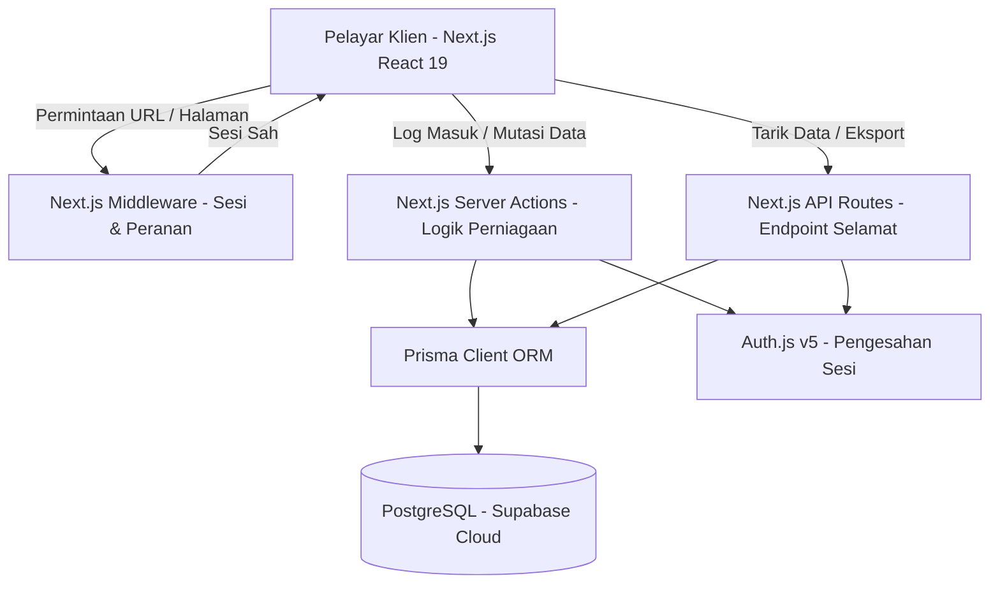
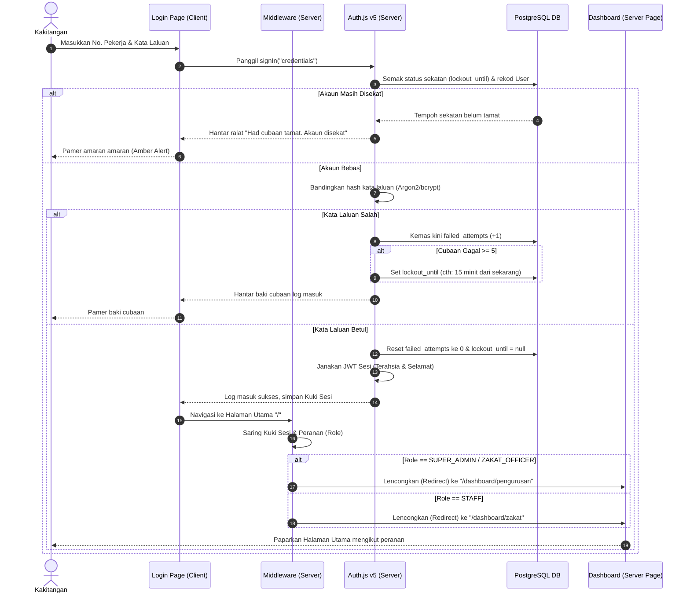
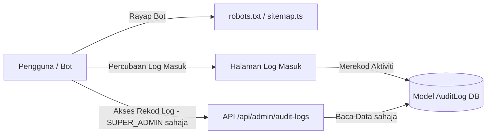
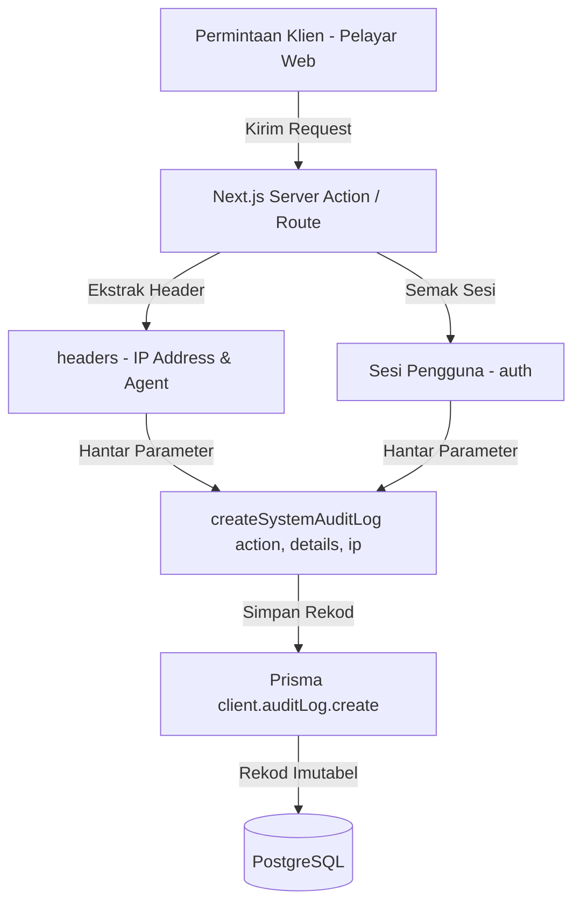
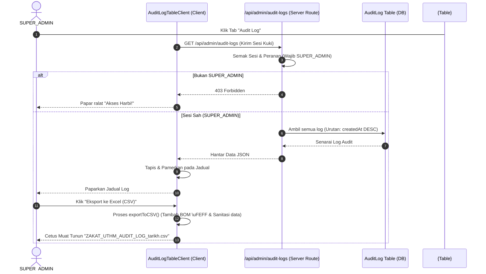
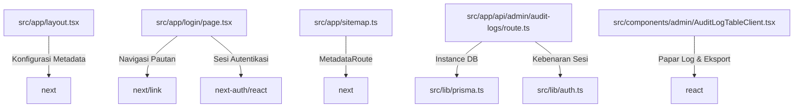

# Dokumentasi Teknikal & Panduan Reverse Engineering: Sistem Caruman Zakat Gaji UTHM

Dokumen ini menyediakan panduan teknikal menyeluruh bagi seni bina sistem, struktur fail, aliran proses, pangkalan data, antaramuka API, komponen utama, log perubahan, serta analisis "reverse engineering" mendalam bagi modul **Jejak Audit Keselamatan & Pengoptimuman SEO** yang baru dibina.

---

## 1. Seni Bina Sistem (Architecture Guide)

Sistem Caruman Zakat Gaji UTHM dibina berasaskan standard industri menggunakan timbunan teknologi (stack) moden:



### Komponen Seni Bina:
*   **Frontend (Next.js 16 App Router & React 19)**:
    *   Menggunakan pembahagian Server Components (secara lalai) untuk pemaparan pantas dan SEO yang baik, serta Client Components (ditandakan `"use client"`) untuk interaksi masa nyata.
    *   Pengurusan gaya (styling) menggunakan **Tailwind CSS** dengan reka bentuk mesra peranti mudah alih (responsive) dan bertema premium.
*   **Backend (Next.js Server Actions & API Routes)**:
    *   Penyediaan logik perniagaan yang selamat secara terus pada pelayan melalui Server Actions, menghapuskan keperluan membina pengawal API tradisional untuk mutasi standard.
    *   API Routes (`/api/admin/audit-logs`, `/api/notifications`) digunakan untuk operasi bacaan data sensitif atau penyediaan fail yang memerlukan kawalan peranan (role control).
*   **Pangkalan Data (PostgreSQL & Supabase)**:
    *   Menggunakan storan PostgreSQL awan Supabase.
    *   Sambungan dibahagikan kepada dua:
        *   `DATABASE_URL` (Pooled / Transaction mode, port 6543) untuk sambungan jangka pendek dari pelayan serverless Vercel bagi mengelakkan limpahan sambungan (connection exhaustion).
        *   `DIRECT_URL` (Non-pooled / Session mode, port 5432) khusus untuk proses migrasi skema Prisma (`prisma migrate dev`).
*   **Autentikasi & Otorisasi (Auth.js v5 / NextAuth.js)**:
    *   Menggunakan strategi sesi berasaskan JSON Web Token (JWT) yang selamat.
    *   Perlindungan laluan (route protection) dilakukan di peringkat Middleware untuk menyaring pengguna mengikut peranan (`Role: STAFF, ZAKAT_OFFICER, SUPER_ADMIN`).
*   **Penyebaran (Deployment)**:
    *   Dihoskan di platform **Vercel** dengan integrasi Serverless Functions.

---

## 2. Panduan Folder (Folder Guide)

Berikut adalah fungsi direktori utama di dalam projek Next.js ini:

```
my-production-app/
├── prisma/                 # Skema pangkalan data & fail migrasi
├── public/                 # Aset statik (Imej, Logo UTHM, Favicon)
├── src/
│   ├── app/                # Laluan Next.js App Router (Halaman & API)
│   ├── components/         # Komponen UI boleh guna semula
│   ├── lib/                # Fungsi utiliti, konfigurasi Prisma & Auth.js
│   └── scripts/            # Skrip penyelenggaraan & seeding
```

### Perincian Direktori Utama:

| Nama Direktori | Fungsi & Tanggungjawab | Larangan Simpanan | Pengguna Utama |
| :--- | :--- | :--- | :--- |
| [`prisma/`](file:///c:/Zakat%20UTHM%20Prototype%20System/my-production-app/prisma) | Menyimpan fail [`schema.prisma`](file:///c:/Zakat%20UTHM%20Prototype%20System/my-production-app/prisma/schema.prisma) dan rekod migrasi SQL. | Jangan simpan fail pemalar aplikasi atau logik perniagaan di sini. | Pembangun Sistem & Prisma CLI |
| [`src/app/`](file:///c:/Zakat%20UTHM%20Prototype%20System/my-production-app/src/app) | Menentukan struktur routing URL. Mengandungi Server/Client Pages, API Routes, `layout.tsx`, `robots.txt`, dan `sitemap.ts`. | Dilarang meletakkan komponen UI yang besar atau terlalu spesifik. Hanya fail halaman (`page.tsx`) dan konfigurasi laluan sahaja. | Enjin Next.js & Bot Carian |
| [`src/components/`](file:///c:/Zakat%20UTHM%20Prototype%20System/my-production-app/src/components) | Menyimpan komponen React (cth: kad, jadual, borang) yang menyusun antaramuka halaman. | Dilarang meletakkan konfigurasi sambungan terus ke DB. Gunakan API atau Server Actions untuk penghantaran data. | Pembangun UI/UX |
| [`src/lib/`](file:///c:/Zakat%20UTHM%20Prototype%20System/my-production-app/src/lib) | Pusat pemula utiliti seperti instance Prisma client ([`prisma.ts`](file:///c:/Zakat%20UTHM%20Prototype%20System/my-production-app/src/lib/prisma.ts)), sesi autentikasi ([`auth.ts`](file:///c:/Zakat%20UTHM%20Prototype%20System/my-production-app/src/lib/auth.ts)), and logger ([`audit.ts`](file:///c:/Zakat%20UTHM%20Prototype%20System/my-production-app/src/lib/audit.ts)). | Dilarang menyimpan fail UI, komponen visual, atau CSS. | Pembangun Backend |

---

## 3. Aliran Proses (Flow Guide)

### Aliran Proses Log Masuk Kakitangan (User Login Flow)

Sistem mengaplikasikan kawalan keselamatan berlapis dari input klien sehinggalah ke panel dashboard:



---

## 4. Panduan Pangkalan Data (Database Guide)

Skema pangkalan data dikawal oleh Prisma ORM dengan entiti-entiti berikut:

### 1. Jadual `User` (Kakitangan & Pentadbir)
*   **Purpose**: Menyimpan profil kakitangan, peranan akses, maklumat gaji semasa, dan kawalan brute-force.
*   **Columns**:
    *   `id` (String, Primary Key): ID CUID unik.
    *   `name` (String, Optional): Nama penuh pengguna.
    *   `email` (String, Unique): Alamat emel rasmi UTHM.
    *   `noPekerja` (String, Unique, Map: `no_pekerja`): No. staf rasmi.
    *   `passwordHash` (String, Map: `password_hash`): Hash kata laluan.
    *   `role` (Enum: `Role`): `STAFF`, `ZAKAT_OFFICER`, atau `SUPER_ADMIN`.
    *   `failedAttempts` (Int): Kiraan gagal log masuk berturut-turut.
    *   `lockoutUntil` (DateTime): Tarikh/masa sekatan tamat.
*   **Relationships**:
    *   Satu-ke-banyak dengan `ZakatStaffSalaryDeductionApplication`.
    *   Satu-ke-banyak dengan `PasswordHistory`.
    *   Satu-ke-banyak dengan `Notification`.
*   **Used by**: Pengesahan log masuk, pengurusan profil, dan semakan keselamatan pelayan.

### 2. Jadual `ZakatStaffSalaryDeductionApplication` (Borang Caruman Zakat)
*   **Purpose**: Rekod permohonan caruman/potongan zakat pendapatan bulanan kakitangan.
*   **Columns**:
    *   `id` (String, Primary Key): ID unik permohonan.
    *   `namaPenuh`, `noKP`, `noPekerja`, `noTelefon`, `alamatRumah`: Maklumat pemohon.
    *   `deductionType` (Enum): Mekanisme potongan (cth: `FIXED_MONTHLY`, `MATCH_PCB`).
    *   `amaunZakatBulanan`, `amaunZakatBaru` (Decimal): Jumlah potongan.
    *   `pengesahanLafaz` (Boolean): Kebenaran lafaz wakil zakat.
    *   `persetujuanAkta709` (Boolean): Kebenaran pemprosesan data peribadi (PDPA).
    *   `status` (Enum: `ApplicationStatus`): Status permohonan (`PENDING`, `APPROVED`, `REJECTED`).
    *   `userId` (String, Foreign Key): Menghubungkan permohonan kepada penciptanya.
*   **Relationships**:
    *   Banyak-ke-satu dengan jadual `User`.
*   **Used by**: Borang permohonan kakitangan, panel pengesahan pegawai zakat, dan sistem penggajian.

### 3. Jadual `AuditLog` (Jejak Keselamatan)
*   **Purpose**: Log peristiwa sistem yang tidak boleh diubah (immutable) bagi tujuan pemantauan forensik keselamatan.
*   **Columns**:
    *   `id` (String, Primary Key): ID log unik.
    *   `userId` (String, Optional): ID pelaku (jika ada).
    *   `userEmail` (String, Optional): Emel pelaku untuk carian pantas.
    *   `action` (String): Nama peristiwa (cth: `"LOG_MASUK_GAGAL"`).
    *   `details` (Json, Optional): Maklumat tambahan terperinci.
    *   `ipAddress` (String): Alamat IP klien asal.
    *   `createdAt` (DateTime): Stempel masa peristiwa.
*   **Relationships**: Tiada (Model bebas untuk mengekalkan kebolehbacaan pantas tanpa pergantungan relasi).
*   **Used by**: Endpoint API `/api/admin/audit-logs` dan komponen klien `<AuditLogTableClient />` bagi kegunaan `SUPER_ADMIN`.

### 4. Jadual `PasswordHistory` (Sejarah Hash Kata Laluan)
*   **Purpose**: Menyimpan sejarah kata laluan lama untuk mencegah kakitangan daripada menggunakan semula kata laluan lama.
*   **Used by**: Fungsi kemas kini kata laluan.

---

## 5. Panduan API (API Guide)

### 1. Tarik Rekod Jejak Audit Keselamatan
*   **Endpoint**: `GET /api/admin/audit-logs`
*   **Authentication**: Diperlukan (Mesti bertaraf `SUPER_ADMIN`).
*   **Response**:
    *   `200 OK`: Mengembalikan senarai rekod log audit tersusun mengikut tarikh terkini.
    ```json
    [
      {
        "id": "cuid-12345",
        "userId": "usr-987",
        "userEmail": "staf@uthm.edu.my",
        "action": "LOG_MASUK_SUKSES",
        "ipAddress": "192.168.1.1",
        "createdAt": "2026-06-26T08:00:00.000Z",
        "details": { "userAgent": "Mozilla/5.0..." }
      }
    ]
    ```
    *   `403 Forbidden`: Pengunjung bukan `SUPER_ADMIN` atau tidak log masuk.
    ```json
    { "error": "Akses Harbi! Anda tidak mempunyai kebenaran Pentadbir untuk melihat audit log." }
    ```

### 2. Sesi & Autentikasi Aplikasi
*   **Endpoint**: `/api/auth/[...nextauth]`
*   **Authentication**: Menguruskan log masuk, keluar, dan token.
*   **Response**: Token JWT disimpan dalam kuki HTTP-Only.

---

## 6. Panduan Komponen (Component Guide)

### 1. `<AuditLogTableClient />` ([AuditLogTableClient.tsx](file:///c:/Zakat%20UTHM%20Prototype%20System/my-production-app/src/components/admin/AuditLogTableClient.tsx))
*   **Input (Props)**: Tiada (Komponen membaca data secara dalaman daripada API).
*   **Output (Render)**:
    *   Bar carian dinamik (penapisan masa nyata berasaskan kata kunci emel, tindakan, atau IP).
    *   Butang "Eksport ke Excel (CSV)" untuk muat turun.
    *   Jadual dengan baris boleh kembang (collapsible rows) menggunakan format `<pre>` untuk memaparkan log metadata JSON secara kemas.
*   **Dependencies**: `react`, `lucide-react`.
*   **Side Effects**: Membuat permintaan `fetch` HTTP GET ke `/api/admin/audit-logs` semasa komponen dipasang (mounted).

### 2. `<LoginForm />` ([page.tsx](file:///c:/Zakat%20UTHM%20Prototype%20System/my-production-app/src/app/login/page.tsx))
*   **Input (Props)**: Mengambil `key` prop secara dinamik dari wrapper.
*   **Output (Render)**: Paparan kad log masuk, pendaftaran, atau set semula kata laluan bergantung pada URL parameter `mode`.
*   **Side Effects**: Memanggil `signIn("credentials")` dari Auth.js secara tak-segerak (asynchronous).

---

## 7. Log Perubahan (Change Log)

### [Versi 1.1.0] — 2026-06-26
*   **Perubahan**: Penambahan sistem jejak audit menyeluruh (Audit Log).
*   **Sebab**: Memenuhi keperluan ketat forensik digital UTHM bagi merekodkan aktiviti penting sistem secara imutabel.
*   **Impak**: Pihak pentadbir `SUPER_ADMIN` kini boleh memantau sejarah aktiviti sistem, mencari pelaku berdasarkan IP/emel, dan mengeksport rekod tersebut ke format CSV/Excel.

### [Versi 1.1.1] — 2026-06-26
*   **Perubahan**: Pengoptimuman On-Page & Technical SEO.
*   **Sebab**: Mengikut standard industri dengan membetulkan markup halaman log masuk (menukar `div soup` kepada `<main>` & `<nav>`), meletakkan atribut `alt` logo yang deskriptif, dan menyediakan fail kawalan rayapan (`robots.txt` & `sitemap.ts`).
*   **Impak**: Kebolehan bot carian merayap halaman awam secara selamat tanpa mendedahkan maklumat dashboard tertutup kakitangan, meningkatkan pemarkahan audit SEO.

---

## 8. Reverse Engineering: Modul Jejak Audit & SEO Optimisation

Modul yang baru dibina ini direkayasa terbalik (reverse engineered) bagi mengesahkan integriti dan ketepatan struktur kodnya.

### 1. Fungsi & Aliran Modul (Module Explanation)
Modul ini bertindak sebagai penjaga integriti sistem. Ia memantau semua aktiviti bernilai tinggi (log masuk, pendaftaran akaun, pertukaran kata laluan) dan merekodkannya ke dalam jadual `AuditLog` secara automatik. Pada masa yang sama, ia menyediakan pintu kawalan keselamatan data dengan menyekat perayapan bot luar ke halaman dashboard yang mengandungi maklumat kakitangan.

### 2. Seni Bina Modul (Module Architecture Diagram)
Seni bina aliran interaksi modul jejak audit dan bot carian:



### 3. Aliran Data Modul (Module Data Flow)
Aliran data peristiwa keselamatan bermula dari klien sehingga disimpan:



### 4. Aliran Urutan Modul (Module Sequence Diagram)
Urutan memaparkan dan mengeksport rekod log audit oleh `SUPER_ADMIN`:



### 5. Graf Kebergantungan Modul (Module Dependency Graph)
Rangkaian import-eksport bagi fail modul:



### 6. Senarai & Penerangan Fungsi (Functions Reference)

#### A. `createSystemAuditLog` (Fail: [`src/lib/audit.ts`](file:///c:/Zakat%20UTHM%20Prototype%20System/my-production-app/src/lib/audit.ts))
*   **Kenapa diwujudkan**: Untuk memusatkan penciptaan rekod audit dari mana-mana tindakan pelayan (Server Actions) bagi memudahkan penyelenggaraan. Ia secara automatik membaca alamat IP asal klien dari header Next.js (`x-forwarded-for` atau fallback) tanpa memerlukan pembangun menulis kod pengekstrakan IP berulang kali.
*   **Design Pattern**: *Wrapper/Utility Pattern* — Membungkus prisma transaction dalam satu utiliti terasing yang selamat dan kalis ralat latar belakang.
*   **Risiko jika dipadam**: Sistem kehilangan keupayaan untuk merekod peristiwa keselamatan. Pentadbir tidak dapat memantau jika berlaku serangan brute-force, ubah suai borang zakat secara tidak sah, atau aktiviti pecah masuk.
*   **Unit Test yang disyorkan**:
    *   Sahkan fungsi tidak melemparkan pengecualian (throw error) jika sesi pengguna adalah null (pengunjung tanpa akaun).
    *   Sahkan fungsi merekodkan alamat IP dengan betul berasaskan objek mock headers.

#### B. `exportToCSV` (Fail: [`src/components/admin/AuditLogTableClient.tsx`](file:///c:/Zakat%20UTHM%20Prototype%20System/my-production-app/src/components/admin/AuditLogTableClient.tsx))
*   **Kenapa diwujudkan**: Membenarkan pegawai forensik keselamatan UTHM memuat turun arkib log ke dalam komputer untuk dianalisis dalam aplikasi Excel atau perisian statistik luaran.
*   **Design Pattern**: *Data Exporter / Stream Pattern*.
*   **Risiko jika dipadam**: Pihak pentadbir tidak mempunyai kaedah alternatif untuk memindahkan data log keselamatan ke luar sistem bagi tujuan pelaporan tahunan atau penyiasatan forensik rasmi.
*   **Unit Test yang disyorkan**:
    *   Sahkan aksara khas atau jawi tidak pecah di Excel dengan memastikan Byte Order Mark (BOM) `\uFEFF` wujud pada permulaan output fail.
    *   Sahkan data JSON pada ruangan metadata disanitasi dengan betul bagi mengelakkan kerosakan struktur kolum CSV (escaping double quotes `""`).

#### C. `sitemap` (Fail: [`src/app/sitemap.ts`](file:///c:/Zakat%20UTHM%20Prototype%20System/my-production-app/src/app/sitemap.ts))
*   **Kenapa diwujudkan**: Menjanjikan perayap enjin carian (Google/Bing) menerima struktur XML URL terkini sistem untuk tujuan indeks.
*   **Design Pattern**: *Registry / Adapter Pattern*.
*   **Risiko jika dipadam**: Carian carian tidak dapat mengetahui kewujudan URL kanonikal baharu sistem secara tersusun, melambatkan proses pengindeksan On-Page portal zakat.
*   **Unit Test yang disyorkan**:
    *   Sahkan jenis pulangan data mematuhi standard `MetadataRoute.Sitemap`.
    *   Sahkan nilai stempel masa `lastModified` sentiasa dikemas kini.
